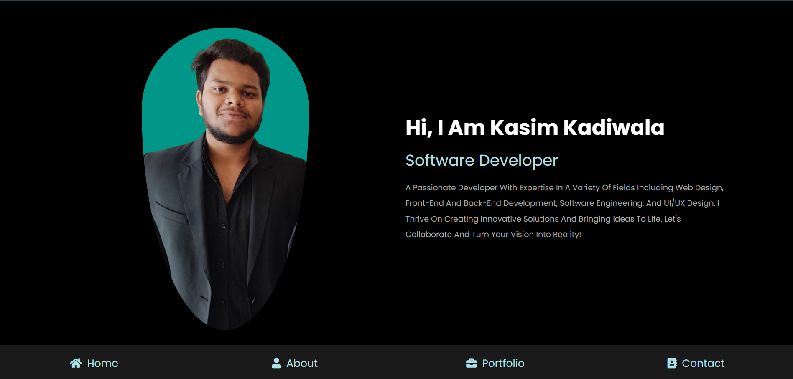

# My Portfolio 

I'm Kasim Kadiwala, a dedicated Full Stack Software Developer on the lookout for exciting new opportunities to apply my expertise and passion for crafting innovative digital solutions.

- Proficient in HTML, CSS, and JavaScript.
- Experienced in building dynamic user interfaces with ReactJS.
- Skilled in server-side development using NodeJS.
- Knowledgeable in scalable web application development with NextJS.
- Competent in database management with MongoDB and MySQL.
- Efficient in styling with TailwindCSS.
- Well-versed in various libraries and frameworks.
- Proven track record of delivering projects on time and within budget.
- Collaborative team player with a knack for problem-solving.
- Committed to staying updated on the latest industry trends and technologies.

I thrive on challenges and am passionate about pushing the boundaries of what's possible in the world of software development. Let's collaborate and bring your ideas to life!

## Learn More
To learn more about the technologies used in this project, take a look at the following resources:

- [JavaScript](https://developer.mozilla.org/en-US/docs/Web/JavaScript)
- [TypeScript](#)
- [Java](https://docs.oracle.com/en/java/)
- [C](#)
- [C++](#)
- [Python](https://docs.python.org/3/)
- [ReactJS](#)
- [React Native](#) 
- [Bootstrap](#)
- [HTML](#)
- [CSS](#)
- [Node.js](#)
- [ExpressJS](#)
- [Next.js](https://nextjs.org/docs)
- [Tailwind CSS](https://tailwindcss.com/docs/installation) 
- [shadcn ](https://ui.shadcn.com/docs)
- [Redux](#)
- [ElectronJS](#)
- [MySQL](#)
- [MongoDB](#)
- [Stream API](https://getstream.io/video/docs/)